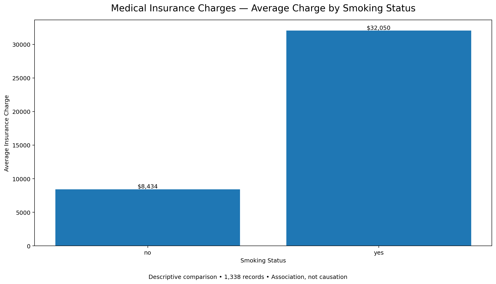

# Medical Insurance Charges Analysis

## Project Overview

This project analyzes a medical insurance dataset to explore how insurance charges vary across demographic, lifestyle, and health-related factors.

The analysis focuses on identifying patterns in medical insurance charges and comparing groups using descriptive statistics such as counts, averages, medians, minimums, and maximums.

## Objectives

The main objectives of this analysis are to:

- Examine the distribution of medical insurance charges.
- Compare insurance charges between smokers and non-smokers.
- Investigate differences in charges across BMI categories.
- Explore how insurance charges vary across age groups.
- Compare charges across sex and geographic regions.
- Examine the relationship between the number of children and insurance charges.
- Explore whether the relationship between age and insurance charges differs by smoking status.
- Examine correlations between selected numerical variables.

## Dataset

The dataset contains **1,338 records** and **9 original variables**.

Key variables include:

- `age` — age of the individual
- `sex` — sex of the individual
- `bmi` — body mass index
- `children` — number of children/dependents
- `smoker` — smoking status
- `region` — residential region
- `charges` — medical insurance charges

Additional analytical variables were created for age bands and BMI categories.

## Tools Used

- Microsoft Excel
- Excel formulas
- Pivot tables
- Descriptive statistics
- Data visualization

## Methodology

The analysis followed these general steps:

1. Reviewed the structure and completeness of the dataset.
2. Checked the variables for missing or inconsistent values.
3. Created analytical age bands.
4. Classified BMI values into standard adult BMI categories.
5. Calculated descriptive statistics for the overall dataset.
6. Compared insurance charges across demographic and lifestyle groups.
7. Used averages and medians alongside totals to avoid misleading comparisons caused by different group sizes.
8. Examined relationships between age, BMI, number of children, smoking status, and insurance charges.
9. Developed summary visualizations to communicate key patterns.

## Key Findings

The analysis indicates that medical insurance charges vary considerably across demographic and lifestyle groups.

Smoking status shows a substantial difference in average insurance charges between smokers and non-smokers. Insurance charges also vary across age bands and BMI categories.

Regional and demographic differences are present as well, although these descriptive comparisons should not be interpreted as evidence that a particular characteristic directly causes higher insurance charges.

The analysis therefore focuses on **patterns and associations rather than causal conclusions**.

## Important Analytical Note

Group totals were not used alone to compare groups because groups contain different numbers of individuals.

For example, a group with more individuals will naturally tend to have a larger total charge. Therefore, **average and median charges** were used alongside counts and total charges to provide more meaningful comparisons.

## Limitations

This project is a descriptive analysis and has several limitations:

- The dataset does not establish causal relationships.
- Observational associations should not be interpreted as causation.
- BMI is a screening measure and should not be treated as a diagnosis.
- The dataset contains a limited set of variables, so other factors that influence insurance charges may not be represented.
- The analysis does not use advanced causal or predictive modeling.

## Project Files

- `Medical_Insurance_Charges_Analysis.xlsx` — Excel analysis containing the cleaned data, descriptive analyses, summary tables, and dashboard.

## Learning Outcome

This project strengthened my ability to:

- Structure and inspect a real-world-style dataset.
- Perform descriptive analysis in Excel.
- Use pivot tables to compare groups.
- Select appropriate summary statistics.
- Recognize misleading comparisons caused by unequal group sizes.
- Communicate analytical findings without overstating causality.
- Document and present a data-analysis project for a professional portfolio.
